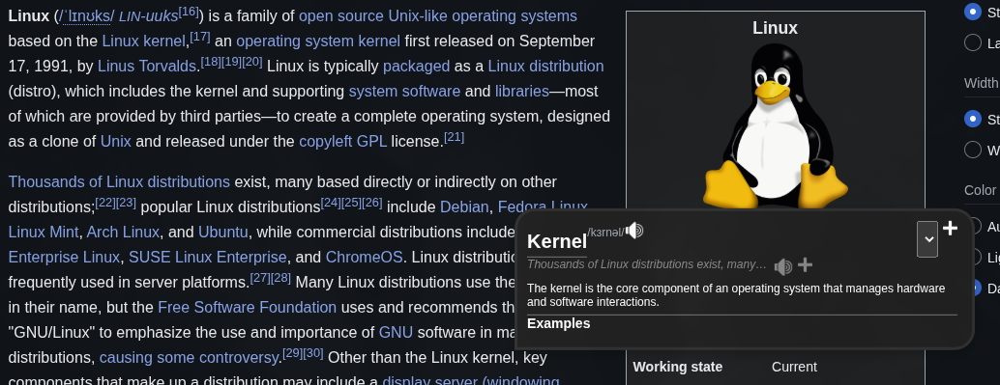
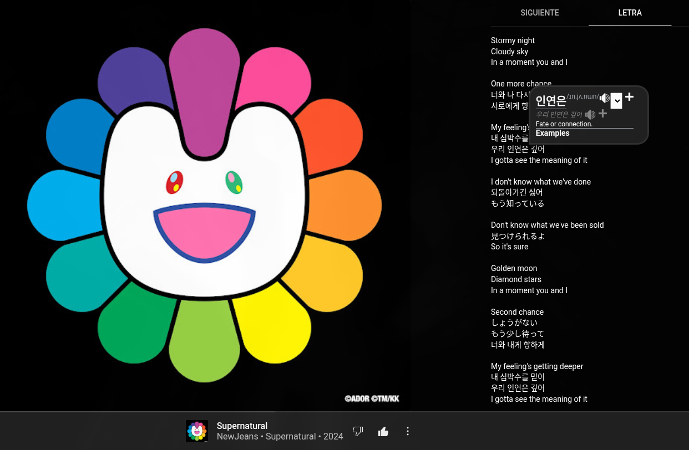

# MaoMao Dict - Frontend


Ultra customizable browser extension with a popup dictionary to help language learners. Get instant context definitions, pronunciation, and save words directly to Anki. Leverages self-attention to bring more versatility to your learning experience.

❗ check also the [backend](https://github.com/MaoMao-Corp/MaoMao-dict-backend) ❗

## Features

- **Popup Dictionary** - Quick contextual lookups in your browser
- **Audio Included** - Get always the correct pronunciation
- **Anki Integration** - Save words and phrases directly to your Anki deck
- **Customizable ASF** - Personalize the information recieved
- **Language Invariant** - Support for ALL language pairs
- **Local Storage** - Keep your settings and history synced

## 🚧 Warning 🚧
We now prioritize privacy, transparency and user empowerment. To reflect this shift in mindset, our project has evolved into a local dictionary that is both free of charge and free-as-in-freedom.

Previously, we relied on OpenAI's API to provide the definitions. We now use a local language model that preserves privacy and gives full control to the user.

**Due to this, many of the features are being refactored**

## Showcase




## Installation

```bash
git clone https://github.com/MaoMao-Corp/MaoMao-dict.git
cd MaoMao-dict
npm install
npm run build
```


Load the extension in your browser:
1. Open `chrome://extensions` (Chrome) or `about:debugging#/runtime/this-firefox` (Firefox)
2. Enable "Developer mode"
3. Click "Load unpacked" and select the build folder

## Contributing

Found a bug or have an idea? Open an issue or submit a PR!

## Backend

Check out the [backend repo](https://github.com/MaoMao-Corp/MaoMao-dict-backend) for API details.
